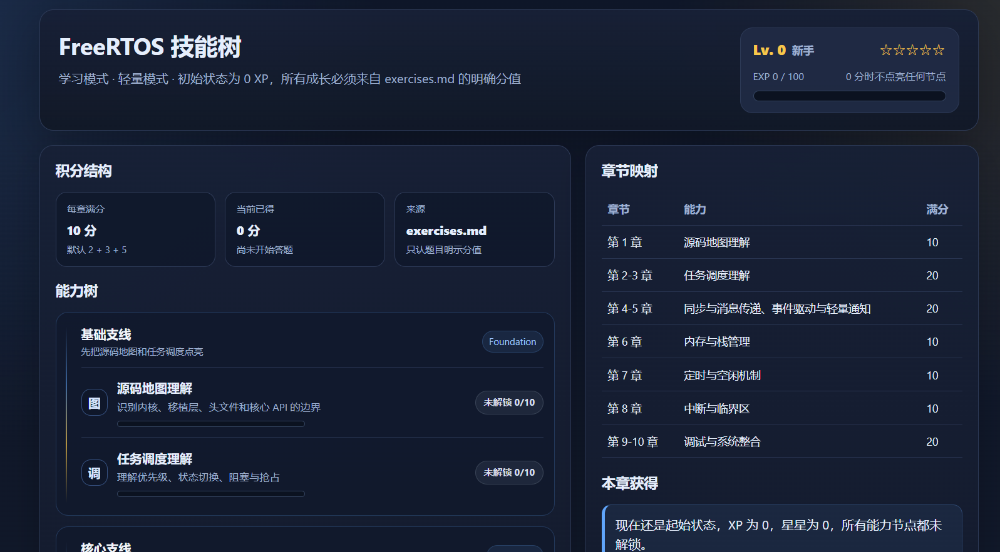
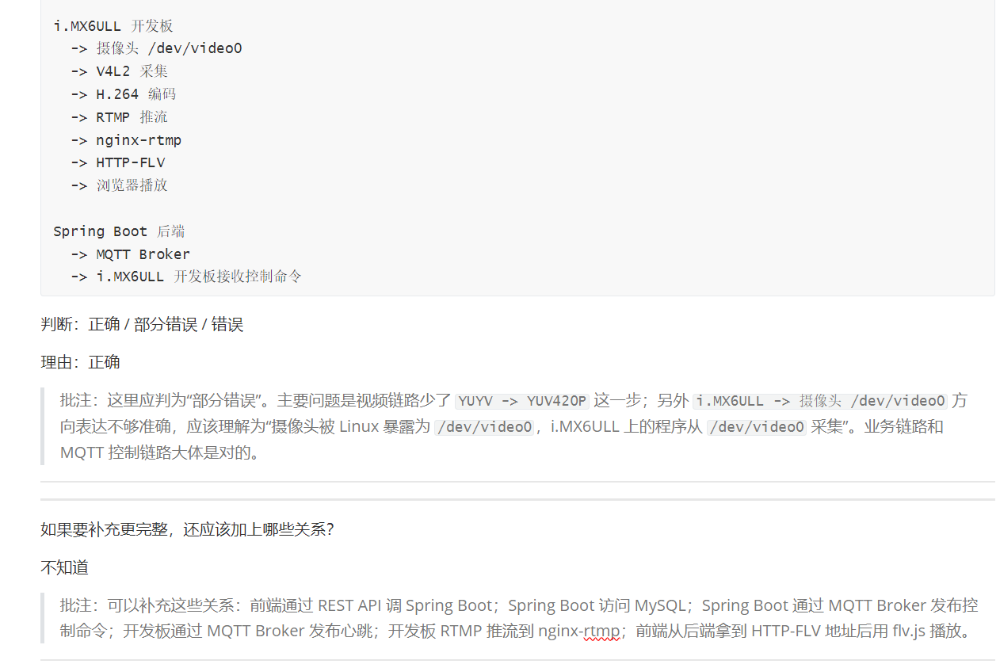
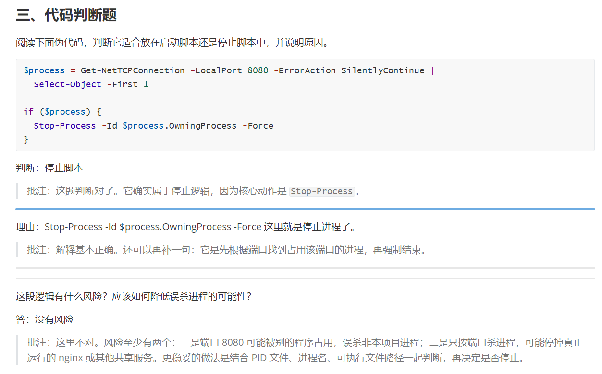

# Learning Workflow Designer

<div align="center">


**把资料、代码和项目任务，变成能学、能练、能验收、能升级的项目驱动学习包。**

当前是 Codex-first Skill；核心学习包规范保持平台无关，并已提供 Claude Code adapter、Prompt Pack 和 Markdown/JSON 模板。

</div>



## 快速开始

### 安装到 Codex

```powershell
git clone https://github.com/heyu-233/learning-workflow-designer.git $env:USERPROFILE\.codex\skills\learning-workflow-designer
```

也可以让 Codex 安装：

```text
请帮我安装这个 skill：https://github.com/heyu-233/learning-workflow-designer
```

### 直接这样用

```text
我想学习这个项目，请整理成学习包。
```

```text
进入 project-lab mode，围绕这个小项目生成 10 章学习路线和练习题。
```

```text
通过练习一步一步完成这个项目，练习题里要有答题空间、运行记录和验收标准。
```

```text
批改我的答案，并更新 learning-progress.json 和 skill-tree.html。
```

### Claude Code

仓库提供了 Claude Code adapter：

```text
adapters/claude-code/
```

安装后可以这样触发：

```text
Use the learning-workflow-designer skill. Enter project-lab mode and generate a 10-chapter learning package in tutorial/.
```

中文：

```text
使用 learning-workflow-designer skill。进入项目实验模式，先做材料审计，再生成默认 10 章学习包。
```

## 它解决什么

很多学习任务的问题不是“没有资料”，而是资料、源码、实验目标和最终项目混在一起，很难知道今天该做哪一步。

Learning Workflow Designer 不是通用 workflow engine。它更准确的定位是 **project-driven learning package designer**：把输入材料整理成一套可执行学习包。

| 原始状态 | 生成之后 |
|---|---|
| 老师布置了一串任务，不知道先学哪块 | 拆成默认 10 章学习路线 |
| 想做项目，但基础知识还没铺好 | 每章练基础，同时推进项目一小步 |
| 练习题像问答清单，没有动手路径 | 练习包含阅读、实现、运行、观察、排查和验收 |
| 学完没记录，进度靠感觉 | 用 XP、等级称号和技能树追踪能力节点 |
| 答案和批改标准分散 | 生成参考答案、验收标准和常见错误 |

## 重做时不会从头来过

如果已经有学习包，skill 会先看已有文件，再决定最小改动范围：

- 复用已有材料审计、章节结构、题目 ID、分值和技能树设置。
- 只重写用户要求改的章节或文件。
- 后续补充运行环境、源码、日志、截图、命令、板子信息或评分要求时，只合并进已有学习包，更新相关 `待确认` 项。
- 只有进度 JSON、分值或节点状态变化时才重新渲染 `skill-tree.html`。
- 只对本轮改过的中文文件跑编码检查。
- Project-Lab 和实操题默认不给完整参考答案，只给验收标准、最低提交证据、常见失败点和排查顺序。

## 平台与可迁移性

这个仓库现在优先服务 Codex，因为 Codex Skill 能直接读文件、写学习包、渲染技能树并持续批改进度。但学习包本身不应该被 Codex 锁死。

| 层级 | 当前状态 | 迁移方向 |
|---|---|---|
| 核心规范 | 已定义章节、练习、答案、进度 JSON、技能树 | 见 `docs/learning-package-spec.md` |
| Codex Skill | 当前主实现 | 继续作为最完整体验 |
| Claude Code | 已提供初版 adapter | 见 `adapters/claude-code/` |
| Prompt Pack | 已提供可复制提示词 | 见 `docs/prompt-pack.md` |
| 模板 | 已提供独立学习包骨架 | 见 `templates/learning-package/` |
| CLI | 未实现 | 后续可做材料审计、脚手架、校验和技能树渲染 |

跨平台使用说明见 `docs/platform-adapters.md`。

## 输入材料审计

学习包质量会受原始材料影响。材料越清楚，练习越能落到具体文件、命令、日志、硬件现象和验收标准上。

生成完整学习包前，skill 会尽量从 5 个维度检查输入：

| 维度 | 关注点 |
|---|---|
| 目标清晰度 | 最终学习目标或项目验收目标是否明确 |
| 资料可访问性 | 源码、文档、截图、日志、课程资料是否可读 |
| 环境清晰度 | 板子、系统、工具链、运行命令、端口或设备路径是否明确 |
| 验收标准 | 是否知道怎样判断“完成了” |
| 学习者约束 | 当前基础、时间、输出格式、章节数是否明确 |

如果材料不足，它应该先输出“已确认 / 待补充 / 影响”，并把生成结果标记为临时学习包，而不是编造不存在的文件、命令或硬件现象。

## 效果预览

| 技能树 | 练习链路 | 答题空间 |
|---|---|---|
|  |  |  |

## Project-Lab Mode

> [!IMPORTANT]
> Project-Lab Mode 用来处理“我想边学边完成一个具体项目”的场景。它不是只讲知识点，而是从最终项目验收目标倒推学习路线和练习任务。

它会：

1. 提取最终项目目标和验收标准。
2. 拆出 4 到 8 个项目里程碑。
3. 保留默认 10 个学习章节，除非用户明确要求改变章节数。
4. 把项目里程碑映射到 10 个章节里。
5. 让每章练习都连接基础知识、源码阅读、实现任务、运行观察和失败排查。

> [!NOTE]
> 章节和里程碑不是一回事。章节是学习节奏；里程碑是贯穿章节的项目实现主线。

Project-Lab 任务通常会包含：

```md
这一步要做什么：
怎么做：
1. 先看/先查：
2. 再修改/新建：
3. 然后运行/观察：
为什么这样做：
做到什么算完成：
如果失败，先查：
填写区：
- 我看了哪些文件/命令：
- 我改了什么：
- 我运行了什么：
- 我看到了什么现象：
- 我判断是否完成的依据：
- 我还不明白的问题：
```

## 示例：FreeRTOS 源码学习

输入可以像这样：

```text
进入 project-lab mode。
目标是深入研究 FreeRTOS 源码，阅读分析主要流程，运行跟踪调试；
同时通过以函数为单位的临摹移植，逐步完成一个 IAP 二级启动小项目。
请生成默认 10 章学习路线、练习题、答题空间和验收标准。
```

输出会更像一套可做的实验路线，而不是泛泛的知识总结：

| 章节段 | 学习重点 | 项目推进 |
|---|---|---|
| 1-2 | 调度器入口、任务创建、链表和 TCB | 建立最小可运行工程和调试观察点 |
| 3-5 | 上下文切换、tick、临界区、队列 | 以函数为单位临摹移植关键路径 |
| 6-8 | 定时器、同步机制、内存管理 | 接入 IAP 协议、Flash 分区和校验 |
| 9-10 | 综合调试、异常恢复、验收报告 | 完成二级启动小项目闭环 |

仓库内置了一个轻量示例：

- `examples/freertos-lightweight/exercises.md`
- `examples/freertos-lightweight/reference-answers.md`
- `examples/freertos-lightweight/learning-progress.json`
- `examples/freertos-lightweight/skill-tree.html`

重新渲染示例技能树：

```powershell
python scripts/render_skill_tree.py examples/freertos-lightweight/learning-progress.json examples/freertos-lightweight/skill-tree.html --skin engineering
```

## 核心模式

| 模式 | 适合场景 | 输出重点 |
|---|---|---|
| Learning Mode | 从零学习项目、论文、课程或代码库 | 先讲解，再练习，默认 10 章 |
| Project-Lab Mode | 边学边完成一个具体项目 | 从最终项目验收目标倒推里程碑和练习 |
| Review Mode | 已学过，想快速复习巩固 | 弱点清单、对照表、短练习 |
| Practice Mode | 主要想刷题并获得反馈 | 练习题、答案、批改和进度更新 |
| Exam Mode | 想做正式自测或模拟考试 | 独立试卷、评分标准、单独答案 |

## 生成文件

默认学习模式会生成一个 `tutorial/` 文件夹：

| 文件 | 用途 |
|---|---|
| `learning-content.md` | 章节化学习内容，包含主线、知识点和源码/材料阅读路径 |
| `exercises.md` | 带答题空间的练习题或项目实验任务 |
| `reference-answers.md` | 参考答案、验收标准、常见错误和排查方向 |
| `learning-progress.json` | XP、等级、星级、题目分值和能力节点状态 |
| `skill-tree.html` | 可视化技能树页面，展示等级、称号、章节映射和下一步任务 |

练习题不会只是一串问题。它会保留可填写的答题区，例如空行、记录表、命令输出区、日志路径区和结论区。

平台无关规范见：

- `docs/learning-package-spec.md`
- `docs/platform-adapters.md`
- `docs/prompt-pack.md`
- `templates/learning-package/`

## 技能树和等级

技能树由 `learning-progress.json` 驱动。XP 只来自显式带分值的练习，不会凭“感觉懂了”自动加分。

默认 5 级：

| 等级 | 默认称号 | XP 阈值 |
|---|---|---|
| Lv.1 | 新手 | 0% |
| Lv.2 | 初学者 | 25% |
| Lv.3 | 进阶者 | 50% |
| Lv.4 | 熟练者 | 75% |
| Lv.5 | 掌握者 | 100% |

默认大多数项目使用 classic 称号组；少数项目会稳定抽到 `sao`、`eu4`、`hoi4` 或 `civ6` 风格称号，增加一点新鲜感。你也可以在 `learning-progress.json` 里指定 `level_title_set` 或自定义 `level_titles`。

## 质量约束

这个 skill 会尽量遵守以下规则：

- 生成完整学习包前先做材料审计；材料不足时列出待补充项。
- 重做已有学习包时先判断改动范围，优先复用旧结构，不默认全量重做。
- 所有题目必须说人话：说明要做什么、怎么做、为什么做、做到什么算完成。
- 不用“建立环境基线、打通链路、构建能力闭环”这类抽象标题糊弄学生。
- 默认学习包为 10 章，除非用户明确要求改变章节数。
- 后面的章节可以复用前面的知识点，前面的章节不能依赖后面才讲的内容。
- 练习题、试卷和项目实验任务必须留下答题空间。
- 工程类任务必须包含可观察证据，例如命令输出、日志、截图路径或运行现象。
- Project-Lab Mode 中，每个主要练习都应该推动最终项目向前完成一小步。
- Project-Lab 和实操题的参考答案默认可以是轻量验收清单，不强制写完整答案。
- 对未知文件、命令、接口、硬件现象或验收日志写 `待确认`，不硬编。
- 中文输出生成后应运行编码检查，避免 PowerShell/CMD 写入导致乱码。

```powershell
python scripts/validate_text_encoding.py tutorial
```

## 目录结构

| 路径 | 说明 |
|---|---|
| `SKILL.md` | skill 主规则和触发说明 |
| `references/` | 模式、题型、输出格式、质量检查、技能树规则 |
| `assets/` | Markdown、JSON 和 HTML 模板 |
| `templates/` | 平台无关学习包骨架 |
| `adapters/` | Claude Code 等平台适配层 |
| `examples/` | 示例学习包 |
| `docs/` | 学习包规范、Prompt Pack 和示例图片 |
| `scripts/` | DOCX 转换、技能树渲染、编码检查等工具 |

## Limitations

- 这是 Codex-first 项目；Claude Code adapter 已可用，但最完整的验证和渲染流程仍在 Codex 侧打磨。
- 输入材料质量会显著影响输出质量；材料不足时只能生成临时学习包。
- 它不是通用工作流编排器，也不负责替代真实编译、烧录、硬件调试或教师验收。
- 生成的练习和答案需要结合真实环境验证，尤其是嵌入式、Linux 驱动、Bootloader 和 RTOS 项目。

## Roadmap

- 完善 source intake：更稳定地输出材料评分、缺失清单和临时学习包。
- 提升 Project-Lab Mode：让练习更像逐步实验手册，而不是题目列表。
- 扩展平台适配：继续完善 Claude Code，并补充 ChatGPT、Claude、Obsidian、VS Code 使用方式。
- 增加 CLI 雏形：输入资料路径，输出材料审计、学习包骨架、质量校验和技能树。
- 增加更多真实示例：FreeRTOS、Linux 驱动、U-Boot、论文阅读和课程复习。

## DOCX 支持

Markdown 和 HTML 输出可直接使用。若需要 DOCX 转换，请确认 Python 环境中安装了 `python-docx`。

```powershell
python scripts/md_to_docx.py learning-content.md learning-content.docx
```

## README 设计参考

这版 README 参考了几个 10k+ star 项目的信息结构：`freeCodeCamp/freeCodeCamp` 的学习定位和目录化组织、`microsoft/vscode` 的产品截图前置、`vercel/next.js` 的简洁 Quickstart、`langchain-ai/langchain` 的一句话定位和生态入口。这里借鉴的是呈现方式，不复制它们的文案。

## License

MIT License. See [LICENSE](LICENSE).
